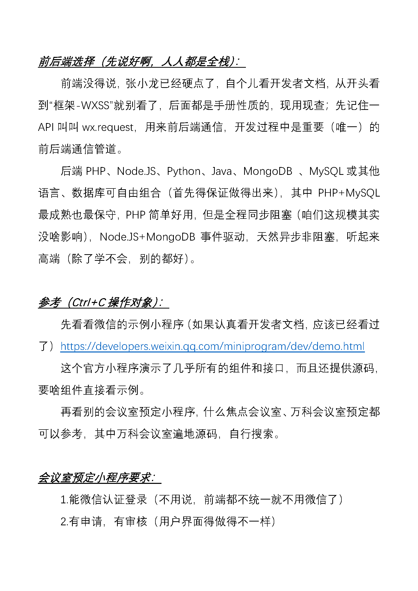

# 老项目合集

:warning: 由于早年间没有使用GitHub的习惯，很多代码都已随着服务器到期、更换电脑等原因遗失，现将一些能找到的资料集合起来，记录下以前的项目经历

<!-- TOC -->

- [老项目合集](#%E8%80%81%E9%A1%B9%E7%9B%AE%E5%90%88%E9%9B%86)
    - [“elab招新”、“elab选课”、“elab考勤”、“微机安装与调试”小程序](#elab%E6%8B%9B%E6%96%B0elab%E9%80%89%E8%AF%BEelab%E8%80%83%E5%8B%A4%E5%BE%AE%E6%9C%BA%E5%AE%89%E8%A3%85%E4%B8%8E%E8%B0%83%E8%AF%95%E5%B0%8F%E7%A8%8B%E5%BA%8F)
        - [软件界面](#%E8%BD%AF%E4%BB%B6%E7%95%8C%E9%9D%A2)
            - [elab招新](#elab%E6%8B%9B%E6%96%B0)
            - [elab选课](#elab%E9%80%89%E8%AF%BE)
            - [elab考勤](#elab%E8%80%83%E5%8B%A4)
            - [微机安装与调试](#%E5%BE%AE%E6%9C%BA%E5%AE%89%E8%A3%85%E4%B8%8E%E8%B0%83%E8%AF%95)
        - [部分文档](#%E9%83%A8%E5%88%86%E6%96%87%E6%A1%A3)
    - [早年间零碎收集](#%E6%97%A9%E5%B9%B4%E9%97%B4%E9%9B%B6%E7%A2%8E%E6%94%B6%E9%9B%86)
        - [基于.NET的消息和文件传输程序](#%E5%9F%BA%E4%BA%8Enet%E7%9A%84%E6%B6%88%E6%81%AF%E5%92%8C%E6%96%87%E4%BB%B6%E4%BC%A0%E8%BE%93%E7%A8%8B%E5%BA%8F)
        - [网页通讯录、四六级查分、招新报名网页](#%E7%BD%91%E9%A1%B5%E9%80%9A%E8%AE%AF%E5%BD%95%E5%9B%9B%E5%85%AD%E7%BA%A7%E6%9F%A5%E5%88%86%E6%8B%9B%E6%96%B0%E6%8A%A5%E5%90%8D%E7%BD%91%E9%A1%B5)
            - [网页通讯录](#%E7%BD%91%E9%A1%B5%E9%80%9A%E8%AE%AF%E5%BD%95)
            - [四六级查分](#%E5%9B%9B%E5%85%AD%E7%BA%A7%E6%9F%A5%E5%88%86)
            - [招新报名网页](#%E6%8B%9B%E6%96%B0%E6%8A%A5%E5%90%8D%E7%BD%91%E9%A1%B5)
        - [使用虚拟机验证的局域网一对多通信程序](#%E4%BD%BF%E7%94%A8%E8%99%9A%E6%8B%9F%E6%9C%BA%E9%AA%8C%E8%AF%81%E7%9A%84%E5%B1%80%E5%9F%9F%E7%BD%91%E4%B8%80%E5%AF%B9%E5%A4%9A%E9%80%9A%E4%BF%A1%E7%A8%8B%E5%BA%8F)

<!-- /TOC -->

## “elab招新”、“elab选课”、“elab考勤”、“微机安装与调试”小程序

这几个小程序是在担任本科生软硬件实验室“电气创新实践基地”助课组组长期间主持完成的，个人主要贡献是培训了数名同学掌握微信小程序前后端开发技术，并完成了服务器及域名购买、ICP认证备案、SSL证书申请和安装、Wamp环境部署、SVN+Hook搭建以及产品原型设计、编写开发任务书、组织压力测试等任务。

由于当时身兼助课组长、团支书、融媒体副部长三职且有一对一编程教学和软件外包的业务，完成人员培训后未参与主要编程工作

### 软件界面

其实这些微信小程序都是一个模子刻出来的，所以简单展示下，表明确实存在

#### elab招新

#### elab选课

#### elab考勤

#### 微机安装与调试

### 部分文档

2018年7月小学期进行微信小程序教学时用的文档，文风比较浮夸，但确实有用：

2018年12月使用surface为微机安装与调试小程序手绘的原型图，要说美观是不太美观，要说起作用还是起了点作用：

2019年1月为选课小程序编写的任务书：

2019年6月为招新小程序编写的任务书：

## 早年间零碎收集

### 基于.NET的消息和文件传输程序

大一学.NET的时候参考网上博客写的一个局域网通信程序，用的socket通信

程序界面，分客户端和服务器

结构图和流程图

### 网页通讯录、四六级查分、招新报名网页

####  网页通讯录
当初还没学小程序的时候，为了开会发短信方便做的网页+后端PHP和MySQL，有录入、修改、导出、查看值班表等功能，前端框架用的bootstrap，现在只找到部分页面截图

#### 四六级查分
在融媒体中心的时候做的一个很小的查询页面，也用的bootstrap

####  招新报名网页
大二上学期的时候做的一个报名表接受和查看应用，前后端齐全，那个时候还不知道bootstrap，手撸的界面

网络和文件结构图

数据库结构

报名页面和籍贯的二级联表

管理员界面

### 使用虚拟机验证的局域网一对多通信程序

左侧为在Ubuntu虚拟机中运行的server.py，右侧为在win10物理机下运行的两个client.py，由于为每一个连接都分配了一个线程，所以两个连接可以同时存在，两个client可以同时与server通信而互不干扰

这里其实可以不用虚拟机，但是大二刚学了python和虚拟机，非要用一下。。。

